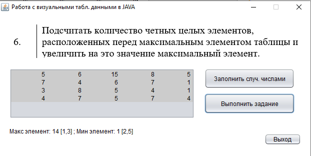

# LEU_lab3
| Фамилия, имя студента | Группа    | Дисциплина  |Тема                              
| --------------------- |:---------:| ------------|:--------------------------------:|
| Лифанов Евгений    | ИС-302    | СВП         |3.Работа с числовыми данными|

Как выглядит визуально выглядит программа: 

